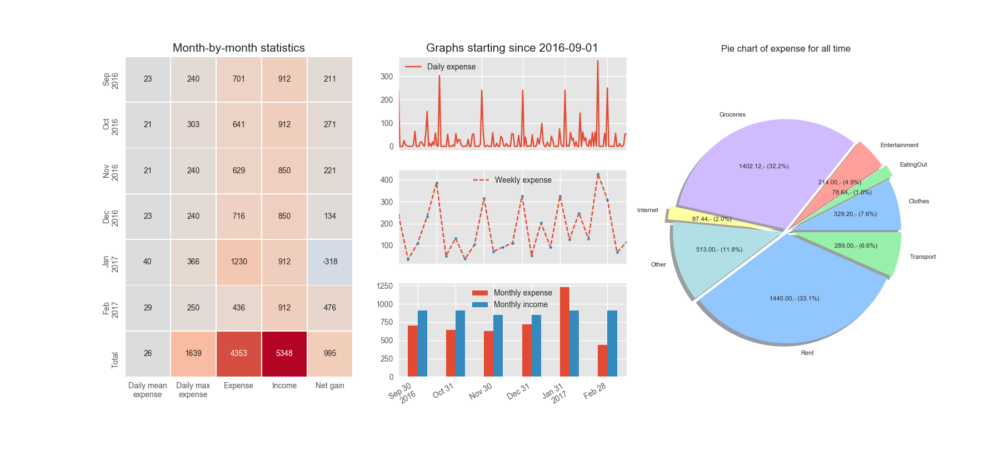

# EcoViz
Python scripts for personal economy tracking and visualization.

## How to get started
Download the four source files and store them in a directory of choice (or just clone the repository). Then when you have a new expense or income you run add_expense.py or add_income.py respectively, to save the expense/income to a data file. As for what type of expense/income type you should use, just do anything you want, for example rent, groceries, transport, entertainemnt, clothes, but try not to use too many different (not more than 8 for example). Some can maybe be combined into a "other" category. Now you have stored some economy data and can run ecoviz.py to visualize the data. Here the data can be visualized either for a (any) single month or for the entire time span since the beginning of expense/income tracking. Instructions for use of command line arguments can be found by providing `--help` flag to either of the three above mentioned scripts.

**Note:** The code is not fully developed so in order for ecoviz.py to work properly, there needs to exist both expense and income data, i.e. you will have to have run add_expense.py and add_income.py with some input data. Also, even if you have entered a lot of expense data, ecoviz.py will still crash if there are no income data.

## Requirements
The code is witten in Python 3.6, but I would assume (untested) any 3.x version will do the job. Unfortunaetly probably uncompatible with Python 2.7. Total list of requirements (excluding standard library modules):
- Python 3.x
- NumPy
- Matplotlib
- Pandas
- Seaborn

Although these can be installed seperately, the often recommended approach is to install the [Anaconda](https://www.continuum.io/downloads) distribution. This Python distribution comes with a ton of useful packages for scientific computing without having to install any packages manually.

## Example data
In the repository there is an example data set. Feel free to use this if you want see how it might look after some months of expense/income tracking. Below is example images that shows the two types of visualizations the program offers.

This image shows a visualization of all expense/income, data in the example set, since the very beginning of expense/income tracking.

This second image shows a visualization of data for one single month (in this case January 2017). All values in both the figures are in US dollars, but you can choose wich ever currency you want when submitting expense/income.

## What happens behind the scene?
When you run add_expense.py and add_income.py for the first time, new directories 'expense' and 'income' are generated. In addition, directories for the relevant year and a new textfile for the month of the input data, are generated. When you add an expense/income in the e.g. same month as before, the scripts appends to the already existing textfile.

Furthermore the main script ecoviz.py utilizes the pandas module for data analysis and visualization. Here, depending on the command line arguments, expense/income data is gathered and plotted in various ways. Here one can definetly change the source if one wishes to represent the data in another way.

## Shortcomings and future development areas
1. As mentioned above, the code does not take into account that a user may only be tracking/inputting expense or income data, but not the other. Adding support for this may be done in the future.
2. The visualization for single month data is not optimal as the bar and pie chart almost shows the same thing. Any idea for something to replace the bar chart here, is welcome.
3. When using ecoviz.py with very little data, the visualization may be rather boring and not so neat looking. Although a flexible solution to this may hard to fix as the data is so limited anyway.
4. After long usage of the software the number of days/weeks/months of data may become large and thus some of the plots/tables (axis, number of rows in table, etc.) in may look like a mess, however this is untested.æ
5. Might be an idea to make the scripts operate as a python module. So might write a setup.py script in the future.
